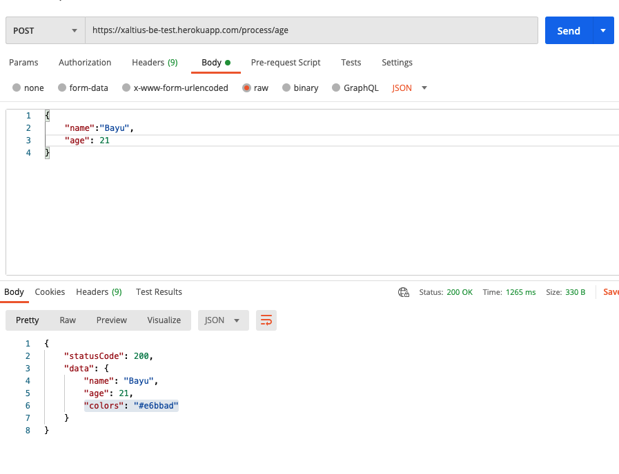

# Developer Technical Test: Age Color Generator (Back-end)

This repository contains the source code for [Age Color Generator](https://xaltius-fe-test.netlify.app/) " back-end service. It contains all services necessary to expose endpoint and handling request.

## Demo

Base URL: [https://xaltius-fe-test.netlify.app/](https://xaltius-fe-test.netlify.app/)

- Endpoint: /process/age
- Request body:
  `{ "name":"Bayu", "age": 21 }`
- Expected response:
  `{ "statusCode":200 "data": { "name":"Bayu", "age": 21, "colors": "#e6bbad" } }`

## Screenshot

## Table of contents

<!-- vim-markdown-toc GFM -->

- [Technologies](#technologies)
- [Packages Structure](#packages-structure)
- [Getting Started](#getting-started)
  - [Setting Up](#setting-up)
  - [How To Build](#how-to-build)
  - [How To Run](#how-to-run)
    - [1. Run Jar Natively](#1-run-jar-natively)
    - [2. Use docker](#2-use-docker)
- [Deployment](#deployment)
  - [Setting up the project on Heroku](#setting-up-the-project-on-heroku)
  - [Deploying to Heroku](#deploying-to-heroku)

<!-- vim-markdown-toc -->

## Technologies

- Spring Framework 5
- Java Servlet API
- Fasterxml Jackson Databind
- Lombok

## Packages Structure

.
...
├── com.xaltius.be
├── config # Configuration for web and servlet
├── controller # Mapping endpoint and attach the handler
|── exception # Exception handing
├── model # Model class
└── service # Service handler

    ...

## Getting started

### Setting up

- Clone this repository: `git clone https://github.com/bayuagpr/be-xaltius-test.git`
- Move into the project directory: `cd be-xaltius-test`
- Install the dependencies: `mvn clean install`

### How to build

- Run the development task: `mvn clean package`

### How to run

There are two options:

#### 1. Run jar natively

- Run the jar: `java -jar target/dependency/webapp-runner.jar target/*.war`
  - Starts a server running at http://localhost:8080
  - Add --port {READY_TO_USE_PORT} to use another port

#### 2. Use docker

Requires the docker installed on the machine

- Build the docker image: `sudo docker build -t xaltius-be-test .`
- Run the docker image: `sudo docker run -d -p 8080:8080 -t xaltius-be-test`
  - Starts a server running at http://localhost:8080
  - Change the first port to use another port

## Deployment

Requires the [Heroku CLI client](https://devcenter.heroku.com/articles/heroku-command-line).

### Setting up the project on Heroku

- Create the Heroku app: `heroku create`

### Deploying to Heroku

- Push code to Heroku: `git push heroku master`
